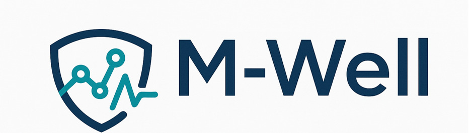

<div align="center">
  <h1 align="center"></img></h1>
  <h4 align="center">ARK based Agentic Quanttitative Risk Analysis</h4>
  <hr>
</div>

This project contains a collection of AI agents built on the **Agent Runtime for Kubernetes (ark)** framework. These agents are designed to perform agentic quanttitative risk analysis tasks.

## Getting Started

Before you begin, ensure you have the following prerequisites installed and configured:

*   **kubectl**: You'll need `kubectl` to interact with your Kubernetes cluster.
*   **Kubernetes Cluster**: A running Kubernetes cluster is required to deploy the agents. Ensure your `kubeconfig` is set up correctly.
*   **ark environment**: This project assumes you have the `ark` development environment set up.

## Agents

This project includes the following agents:
*   **Google Finance Agent**: An agent that integrates with SerpAPI to fetch Google Finance trends.
*   **Economic Evaluator Agent**: An agent to evaluate economic indicators.
*   **Smart Risk Detector**: An advanced AI agent for financial risk and opportunity analysis.
*   **Team Agent** and **App Orchestrator Agent**: To orchestrate agents.

## Deployment

### Smart Risk Detector Agent

To deploy the Smart Risk Detector Agent, run the following script from the `project/scripts` directory:

```bash
./deploy-smart-risk-detector.sh
```

This script will:
1.  Deploy the Smart Risk Detector MCP Server.
2.  Deploy the necessary tools.
3.  Deploy the agent itself.
4.  Deploy sample queries.

### Google Finance Agent

To deploy the Google Finance Agent, you first need to create a Kubernetes secret with your SerpAPI key.

1.  **Create the SerpAPI Secret**:
    *   Get your API key from [https://serpapi.com/](https://serpapi.com/).
    *   Create a secret named `serpapi-secret` with your key. You can use the following command:
        ```bash
        kubectl create secret generic serpapi-secret --from-literal=api-key='YOUR_SERPAPI_KEY_HERE'
        ```
        Replace `YOUR_SERPAPI_KEY_HERE` with your actual key.

2.  **Deploy the Agent**:
    Run the following script from the `project/scripts` directory:
    ```bash
    ./deploy-google-finance.sh
    ```
    This will deploy the tool, the agent, and a sample query.

## Testing

Once the agents are deployed, you can test them in several ways.

### Using `curl`

You can send requests to the agents using `curl`. Note that the URL might change based on your `ngrok` or ingress setup.

*   **Economic Evaluator Agent**:
    ```bash
    curl -X POST "https://<your-ngrok-url>/agent/economic-evaluator-agent" -H "Content-Type: application/json" -d '{ "input": "evaluate new values of inflation (0.5 update 10%), exchange rate (0.6 update 20%)" }'
    ```

*   **Smart Risk Detector Agent**:
    ```bash
    curl -X POST "https://<your-ngrok-url>/agent/smart-risk-detector-agent" -H "Content-Type: application/json" -d '{ "input": "Analyze risks: inflation 3.2%, interest rate 4.5%, exchange rate 1.15" }'
    ```

*   **Google Finance Agent (via Smart Risk Detector)**:
    ```bash
    curl -X POST "https://<your-ngrok-url>/agent/smart-risk-detector-agent/agent/google-finance-agent" -H "Content-Type: application/json" -d '{ "input": "what are the trends in morocco" }'
    ```
*   **App Orchestrator Agent**:
    ```bash
    curl -X POST "https://<your-ngrok-url>/agent/app-orchestrator-agent" -H "Content-Type: application/json" -d '{ "input": "what you want !" }'
    ```


### Using `fark`

The `fark` CLI tool provides a convenient way to interact with your agents.

*   **Smart Risk Detector Agent**:
    ```bash
    # Basic risk analysis
    fark agent smart-risk-detector-agent 'Analyze risks for inflation 4.5%, interest rate 5.2%, exchange rate 1.15'

    # Comprehensive analysis
    fark agent smart-risk-detector-agent 'Perform smart risk analysis for TechCorp with inflation 3.2%, rates 4.5%, FX 1.15'
    ```

### Using `kubectl`

You can check the status and output of queries directly with `kubectl`.

*   **Check Deployed Resources**:
    ```bash
    # For Smart Risk Detector
    kubectl get mcpserver,tool,agent,query | grep smart-risk

    # For Google Finance
    kubectl get tool,agent,query | grep google-finance
    ```

*   **View Query Results**:
    ```bash
    # For Google Finance
    kubectl get query google-finance-trends-query -o yaml
    ```

*   **Monitor Logs**:
    ```bash
    kubectl logs -l app=ark-controller -f
    ```
